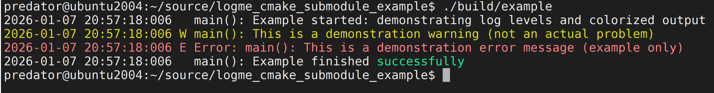

# logme CMake Submodule Example



This repository demonstrates a practical way to integrate
[logme](https://github.com/efmsoft/logme) into a CMake-based C++ project using git submodules.

The example supports:
- building and linking **logme** as **STATIC** or **SHARED** (`LOGME_LINKAGE`)
- optional **JSON configuration loading** via **jsoncpp** (`USE_JSONCPP`)
- optional **errno / error code name formatting** via **AllStat** (`USE_ALLSTAT`)
- enabling logme output in **Release** builds (`LOGME_INRELEASE`)

This repository is intended to be referenced from the **logme wiki**
as a canonical integration example.

---

## Project Layout

```
.
├── CMakeLists.txt
├── README.md
├── src/
│   └── main.cpp
└── external/
    ├── logme/        # git submodule (required)
    ├── jsoncpp/      # git submodule (optional, USE_JSONCPP)
    └── allstat/      # git submodule (optional, USE_ALLSTAT)
```

---

## CMake Options

### `LOGME_LINKAGE` (STATIC / SHARED)

Controls how logme is built and linked:

- `STATIC` → links against the `logme` static library
- `SHARED` → links against the `logmed` shared library

Default in this example: `STATIC`.

Usage:

```bash
cmake -S . -B build -DLOGME_LINKAGE=STATIC
# or
cmake -S . -B build -DLOGME_LINKAGE=SHARED
```

### `USE_JSONCPP` (ON / OFF)

Enables jsoncpp integration. When enabled:
- jsoncpp is built from `external/jsoncpp`
- logme is built with JSON support so it can load configuration from JSON
- the example code demonstrates loading configuration from a JSON **string**
  and then:
  - changing output formatting
  - creating a log file on disk
  - setting variables from code and using them during configuration loading

This integration is **optional**. Default in this example: **OFF**.

If your project does not load logme configuration from JSON, you can keep it **OFF**.

Usage:

```bash
cmake -S . -B build -DUSE_JSONCPP=ON
# or
cmake -S . -B build -DUSE_JSONCPP=OFF
```

### `USE_ALLSTAT` (ON / OFF)

Enables AllStat integration. When enabled:
- AllStat is used to print error codes not only as numbers, but also as named constants
- the example code demonstrates formatting of `errno` values

This integration is **optional**. Default in this example: **OFF**.

Usage:

```bash
cmake -S . -B build -DUSE_ALLSTAT=ON
# or
cmake -S . -B build -DUSE_ALLSTAT=OFF
```

---

## Setup

Clone the example and initialize submodules:

```bash
git clone https://github.com/efmsoft/logme_cmake_submodule_example.git
cd logme_cmake_submodule_example
git submodule update --init --recursive
```

---

## Build

### Linux / macOS

```bash
cmake -S . -B build -DCMAKE_BUILD_TYPE=Release
cmake --build build
./build/example
```

### Windows

If you use a **single-config** generator (e.g. Ninja):

```powershell
cmake -S . -B build -DCMAKE_BUILD_TYPE=Release
cmake --build build
build\example.exe
```

If you use a **multi-config** generator (Visual Studio):

```powershell
cmake -S . -B build
cmake --build build --config Release
build\Release\example.exe
```

---

## Key Points

- logme is integrated as a git submodule and built via `add_subdirectory(external/logme)`
- Release logging is enabled with:

```cmake
target_compile_definitions(example PRIVATE LOGME_INRELEASE)
```

- `USE_JSONCPP` and `USE_ALLSTAT` are optional and can be disabled if not needed
- `LOGME_LINKAGE` lets you switch between static and shared usage

---

## License

This repository is provided as an example. See `LICENSE`.

